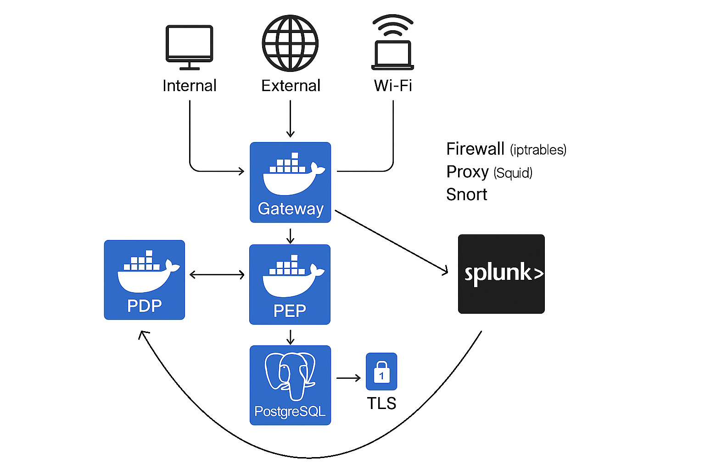

# 🛡️ ZT-Bank

<div align="center">
  <br/>
  
  <br/>
  <br/>
  <p>
    Progetto del corso di Advanced-CyberSecurity 2024/2025 <br/>
    Realizzazione di un'architettura Zero Trust
  </p>
  <br/>
  <p>
    <a href="#busts_in_silhouette-team-members"><strong>Team Members</strong></a> ·
    <a href="#rocket-overview"><strong>Overview</strong></a> ·
    <a href="#classical_building-architettura"><strong>Architettura</strong></a> ·
    <a href="#file_folder-complete-project-structure"><strong>Complete Project Structure</strong></a> ·
    <a href="#memo-policy-implementate"><strong>Policy Implementate</strong></a> ·
    <a href="#wrench-come-buildare-e-avviare"><strong>Come Buildare e Avviare</strong></a> ·
    <a href="#closed_lock_with_key-verifica-ssl-e-interazioni-pep"><strong>Verifica SSL e Interazioni PEP</strong></a> ·
    <a href="#gear-esecuzione-use-cases"><strong>Esecuzione Use Cases</strong></a> ·
    <a href="#key-account-types"><strong>Account Types</strong></a> ·
    <a href="#bar_chart-monitoring-logs-e-splunk"><strong>Monitoring, Logs e Splunk</strong></a> ·
    <a href="#handshake-contributing"><strong>Contributing</strong></a>
  <p><strong>Tecnologie utilizzate: </strong></p>
  <br/>
  <p>
    <a href="https://www.docker.com/">
      
    </a>
    <a href="https://www.postgresql.org/">
      
    </a>
    <a href="https://www.netfilter.org/projects/iptables/index.html">
      
    </a>
    <a href="https://www.squid-cache.org/">
      
    </a>
    <a href="https://www.snort.org/">
      
    </a>
    <a href="https://www.splunk.com/">
      
    </a>
  </p>
</div>

---

## :busts_in_silhouette: Team Members

- [Luca Bellante](https://github.com/lucabellantee)
- [Giansimone Coccia](https://github.com/Giansimone-Coccia)
- [Laura Ferretti](https://github.com/LauraFe01)
- [Federico Staffolani](https://github.com/fedeStaffo)
- [Micol Zazzarini](https://github.com/MicolZazzarini)

---

## :rocket: Overview

Questo progetto realizza un'infrastruttura di sicurezza informatica per un sistema bancario, ispirata ai principi dell'architettura Zero Trust, su una rete suddivisa in tre segmenti: interna, esterna e Wi-Fi. L'obiettivo è monitorare e regolare rigorosamente tutto il traffico verso il database, risorsa critica dell’infrastruttura.

Ogni richiesta di accesso alle risorse è sottoposta a controlli rigorosi di autenticazione, autorizzazione e monitoraggio, con valutazione dinamica della fiducia basata su molteplici fattori. L’architettura è progettata per essere adattiva e resiliente, proteggendo il database tramite accessi controllati, monitoraggio continuo, micro-segmentazione e reazione rapida alle anomalie. In questo modo, ogni richiesta viene trattata come sospetta fino a prova contraria, garantendo una sicurezza moderna e mirata.

---

## :classical_building: Architettura

L’architettura del sistema si fonda su un modello a microservizi, dove ogni componente di sicurezza è isolato in un container Docker dedicato. Questo approccio garantisce:

- **Segmentazione logica e fisica** delle funzioni di rete
- **Maggiore sicurezza** grazie all’isolamento dei servizi
- **Scalabilità** e **manutenibilità** semplificate

### Componenti principali

- **Client**  
  Tre tipologie di client (external, internal, wifi), ciascuno collegato a una rete separata (esterna, interna, Wi-Fi).  
  Ogni client può inviare richieste di accesso alle risorse protette.

- **Gateway**  
  Punto di controllo centrale che:
  - Applica regole firewall tramite iptables
  - Gestisce il proxy Squid per il traffico HTTP/HTTPS
  - Monitora il traffico di rete con Snort (IDS)
  - Redirige e filtra il traffico verso il PEP

- **Policy Enforcement Point (PEP)**  
  - Riceve tutte le richieste dai client tramite il gateway
  - Autentica l’utente
  - Inoltra la richiesta di autorizzazione al PDP

- **Policy Decision Point (PDP)**  
  - Valuta la richiesta secondo policy dinamiche, punteggi di fiducia, blacklist e regole granulari
  - Restituisce una decisione (allow/deny) al PEP

- **Database (PostgreSQL)**  
  - Rappresenta la risorsa sensibile
  - Protetto tramite TLS
  - Accessibile solo dopo aver superato tutti i controlli Zero Trust

- **Splunk**  
  - Raccoglie e analizza i log generati da tutti i componenti
  - Fornisce dashboard di monitoraggio e allarmi automatici in caso di eventi sospetti

### Flusso operativo

1. **Il client invia una richiesta** →  
   Il traffico passa attraverso il gateway, che applica controlli di sicurezza e inoltra la richiesta al PEP.

2. **Autenticazione e autorizzazione** →  
   Il PEP autentica l’utente e chiede al PDP se l’operazione è consentita.

3. **Valutazione della richiesta** →  
   Il PDP applica policy di sicurezza, verifica blacklist e punteggi di fiducia, e restituisce la decisione.

4. **Accesso al database** →  
   Se autorizzato, il PEP esegue l’operazione richiesta sul database.

5. **Monitoraggio centralizzato** →  
   Tutti gli eventi e i log vengono inviati a Splunk per analisi e risposta automatica agli incidenti.


<div align="center">
  
</div>

## :file_folder: Complete Project Structure

```bash
.
├── client_external/
│   ├── Dockerfile
│   ├── entrypoint.sh
│   └── uc.sh
├── client_internal/
│   ├── Dockerfile
│   ├── entrypoint.sh
│   └── uc.sh
├── client_wifi/
│   ├── Dockerfile
│   ├── entrypoint.sh
│   └── uc.sh
├── db/
│   ├── certs/
│   │   ├── server.crt
│   │   └── server.key
│   ├── init/
│   │   └── 03_ssl.sh
│   ├── data.sql
│   └── schema.sql
├── gateway/
│   ├── Dockerfile
│   ├── apply_blacklist.sh
│   ├── entrypoint.sh
│   ├── local.rules
│   ├── policy.yaml
│   ├── requirements.txt
│   ├── rules.sh
│   ├── snort.conf
│   └── squid.conf
├── logs/
│   ├── policy-engine/
│   ├── router/
│   ├── snort/
│   │   └── logs (snort.log files)
│   └── squid/
│       ├── access.log
│       └── cache.log
├── pdp/
│   ├── data/
│   │   ├── blacklist/
│   │   │   └── blacklist.txt
│   │   ├── GeoLite2-Country.mmdb
│   │   └── trust_db.json
│   ├── .env
│   ├── Dockerfile
│   ├── encrypt_existing.py
│   ├── entrypoint.sh
│   ├── pdp.py
│   ├── policies.py
│   └── utils.py
├── pep/
│   ├── db_scripts/
│   │   ├── db_DAO.py
│   │   ├── db_exec.py
│   │   ├── db_operations.py
│   │   └── __init__.py
│   ├── .env
│   ├── create_users.py
│   ├── Dockerfile
│   ├── pep.py
│   ├── users_db.json      
│   └── user_auth.py
└── splunk-apps/
    ├── dashboard/
    │   └── default/
    │       ├── data/
    │       │   └── ui/
    │       │       ├── nav/default.xml
    │       │       └── views/
    │       │           ├── snort_attack_dashboard.xml
    │       │           └── squid_traffic_dashboard.xml
    │       └── metadata/default.meta
    ├── log_inputs/
    │   ├── local/
    │   │   ├── app.conf
    │   │   ├── inputs.conf
    │   │   ├── props.conf
    │   │   └── savedsearches.conf
    │   └── metadata/local.meta
    └── lookups/
        ├── geo_attr_countries.csv
        ├── geo_attr_us_states.csv
        ├── geo_countries.kmz
        ├── geo_us_states.kmz
        ├── known_clients.csv
        └── README
```

---

## :memo: Policy Implementate

Le principali policy di sicurezza implementate nell’architettura Zero Trust sono:

1. **Reputazione storica degli IP e monitoraggio eventi**
   - **Snort-Attack-Detection-30Days**: Se un IP genera più di 60 alert Snort negli ultimi 30 giorni, viene inserito immediatamente in blacklist e bloccato.
   - **Non-Working-Hours-Detection-More-Than-10-IPs**: Più di 5 accessi da IP noti fuori orario lavorativo (20:00-08:00) negli ultimi 30 giorni riducono il punteggio di fiducia dell’IP di 15 punti.
   - **TrustReputation-Increase**: Nessun evento malevolo in 30 giorni comporta un aumento di 1 punto fiducia.
   - **TrustReputation-Decrease**: HTTP POST anomali simili a DoS verso il PEP comportano una riduzione di 40 punti fiducia.
   - **Attacchi DoS**: comportano una riduzione della fiducia.

2. **Monitoraggio in tempo reale degli attacchi**
   - **PortScanning-HighRate-Detection**: Port scanning ad alta frequenza porta a blacklist e blocco immediato dell’IP.
   - **ShellCode-Injection-Detection**: Tentativi di shellcode injection nei log Snort portano a blacklist e blocco immediato dell’IP.

3. **Controllo in tempo reale della rete di origine**
   - Rete esterna (`172.21.0.0/24`): riduzione di 5 punti fiducia.
   - Rete Wi-Fi (`172.22.0.0/16`): riduzione di 5 punti fiducia.
   - Rete interna (`172.20.0.0/16`): aumento di 10 punti fiducia.

4. **Geolocalizzazione**
   - Richieste da IP non italiani subiscono una penalità di 40 punti nel punteggio di fiducia.

5. **Controllo orario delle richieste**
   - Le richieste fuori orario lavorativo vengono monitorate e possono essere bloccate tramite proxy Squid.

6. **Autenticazione utente e fiducia basata sul ruolo**
   - Nessuna operazione sul database è consentita senza login.
   - Punteggi di fiducia iniziali per ruolo:
     - Direttore: 85
     - Consulente: 75
     - Cassiere: 70
     - Cliente: 60

7. **Autorizzazione alle operazioni sulle risorse**
   - Per autorizzare un’operazione su una risorsa del database devono essere verificate tutte le seguenti condizioni:
     - Il ruolo dell’utente consente l’operazione.
     - Il ruolo consente l’accesso alla risorsa.
     - La media tra punteggio di fiducia dell’IP e dell’utente supera una soglia prestabilita.

   | Tipo Documento        | Operazione           | Soglia minima (read/write/delete) |
   |----------------------|----------------------|------------------------------------|
   | Dati personali       | read / write / delete| 60 / 80 / 80                       |
   | Dati transazionali   | read / write / delete| 65 / 75 / 80                       |
   | Documenti operativi  | read / write / delete| 60 / 70 / 80                       |

   | Ruolo      | Permessi                                                                 |
   |------------|--------------------------------------------------------------------------|
   | Direttore  | Tutte le operazioni su tutti i documenti                                 |
   | Consulente | Solo lettura e scrittura su documenti operativi                          |
   | Cassiere   | Lettura e scrittura su documenti transazionali e operativi               |
   | Cliente    | Sola lettura su documenti personali                                      |

---

## :wrench: Come Buildare e Avviare

1. **Assicurarsi di essere nella directory root del progetto**
2. **Verificare che i file `.sh` usino line endings Unix (`LF`)**
   ```bash
   find . -type f -name "*.sh" -exec sed -i 's/\r$//' {} +
   ```
3. **Creare file `.env` nella root con i seguenti contenuti:**
   ```dotenv
   POSTGRES_USER=<insert user>
   POSTGRES_PASSWORD=<insert password>
   POSTGRES_DB=<insert name db>
   SPLUNK_PASSWORD=<insert password>
   ```
4. **Avviare tutti i container con build**
   ```bash
   docker compose up --build -d
   ```
5. **Verificare lo stato dei servizi**
   ```bash
   docker compose ps
   ```
6. **Fermare ed eliminare i container, network e volumi**
   ```bash
   docker compose down -v
   ```

---

##  :closed_lock_with_key: Verifica SSL e Interazioni PEP

1. **Controllare che PostgreSQL accetti connessioni SSL**
   ```bash
   docker exec -it db bash
   psql "sslmode=require host=localhost dbname=bankDB user=user password=cyber_pwd"
   ```
2. **Esempi di richieste al PEP via `curl`**
   - **Login**:

     ```bash
     curl -X POST http://172.24.0.3:3100/login \
       -H "Content-Type: application/json" \
       -c cookies.txt \
       -d '{"username": "giovanni.rossi", "password": "pass_direttore"}'
     ```

   - **Operazione di lettura**:

     ```bash
     curl -X POST http://172.24.0.3:3100/request \
       -H "Content-Type: application/json" \
       -b cookies.txt \
       -d '{"operation": "read", "document_type": "Dati Transazionali", "doc_id": 1}'
     ```

   - **Operazione di scrittura**:

     ```bash
     curl -X POST http://172.24.0.3:3100/request \
       -H "Content-Type: application/json" \
       -b cookies.txt \
       -d '{
         "operation": "write",
         "document_type": "Dati Transazionali",
         "nome_file": "fattura_123.pdf",
         "contenuto": "Contenuto della fattura...",
         "sensibilita": "sensibile"
       }'
     ```

   - **Operazione di cancellazione**:

     ```bash
     curl -X POST http://172.24.0.3:3100/request \
       -H "Content-Type: application/json" \
       -b cookies.txt \
       -d '{"operation": "delete", "document_type": "Dati Transazionali", "doc_id": 2}'
     ```

---

## :gear: Esecuzione Use Cases

Per eseguire gli script di use case (`uc.sh`) all’interno dei container:

```bash
docker exec -it <nome_servizio> bash ./uc.sh
```

Esempio:

```bash
docker exec -it client_internal bash ./uc.sh
```

---

## :key: Account Types

I tipi di account sono:

```json
{
  "accounts": [
    { "username": "giovanni.rossi", "role": "Direttore", "password": "pass_direttore" },
    { "username": "marco.bianchi", "role": "Cassiere", "password": "pass_cassiere" },
    { "username": "luca.verdi", "role": "Consulente", "password": "pass_consulente" },
    { "username": "maria.neri", "role": "Cliente", "password": "pass_cliente" }
  ]
}
```

Modificare o aggiungere nuovi tipi di account tramite lo script `pep/create_users.py`.

---

## :bar_chart: Monitoring, Logs e Splunk

I log sono raccolti in `logs/` e mostrano:

- **Policy Engine**: `logs/policy-engine`
- **Router**: `logs/router`
- **Snort**: `logs/snort`
- **Squid**: `logs/squid`

Dopo aver avviato i container, aprire nel browser:

```
http://localhost:8000/
```

per accedere a Splunk e visualizzare le dashboard personalizzate. Il nome utente è: "**admin**", mentre la password è quella che viene inserita nel file **.env**, presente nella sezione [🛠️ Come Buildare e Avviare](#🛠️-come-buildare-e-avviare).

### 📈 Dashboards 

1. **Snort Attack Dashboard**
   - Visualizza in tempo reale gli alert IDS generati da Snort.
   - Grafico temporale dei rilevamenti per evidenziare picchi di attacco.
   - Top signature alert più frequenti.
   - Classifica IP sorgenti più attivi.
   - Contatori riassuntivi di alert totali e severità.

2. **Squid Traffic Monitoring Dashboard**
   - Trend orario delle richieste proxy negli ultimi 30 giorni.
   - Top 10 URL più richiesti con percentuale di traffico.
   - Top 10 IP client più attivi.
   - Indicatori numerici di richieste totali e URL unici nelle ultime 24h.
   - Distribuzione dei metodi HTTP (GET, POST, ecc.).

---

## :handshake: Contributing

Apri issue, discussion o pull request per suggerimenti e miglioramenti!
